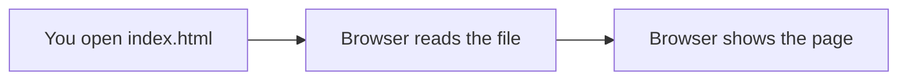

# Architecture — Stage 0: Create the Game Screen

## Current Structure

```
box-runner/
└── index.html
```

One folder, one file. That is the entire project right now.

## Data Flow

There is no data flow yet. The browser reads `index.html` from disk and renders it. No server, no JavaScript, no network requests.



## What Changed

This is the first stage, so everything is new. The important thing is what does **not** exist yet:

- No Git repository
- No CSS file
- No JavaScript
- No build tools

You are looking at the absolute minimum needed to show something in a browser. Stage 1 adds Git on top of this.
