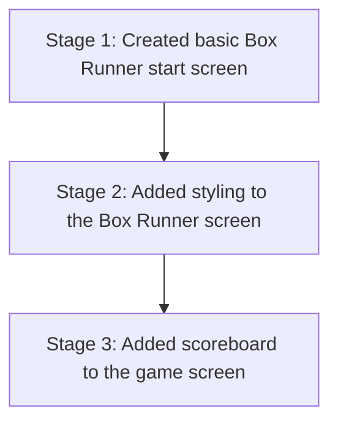

# Architecture — Stage 3: Add the Scoreboard

## Current Structure

```
box-runner/
├── .git/
├── index.html
└── style.css
```

No new files. The `index.html` grew by four lines and `style.css` grew by one rule.

## Git History



Three commits in a straight line. Every new stage from here on will add exactly one node on top of this chain until you start branching in Stage 4.

## What Changed

The project gained its first reusable component pattern — a container `<div>` with a class name, plus a matching CSS rule. Nothing is reused yet, but the pattern is in place.
