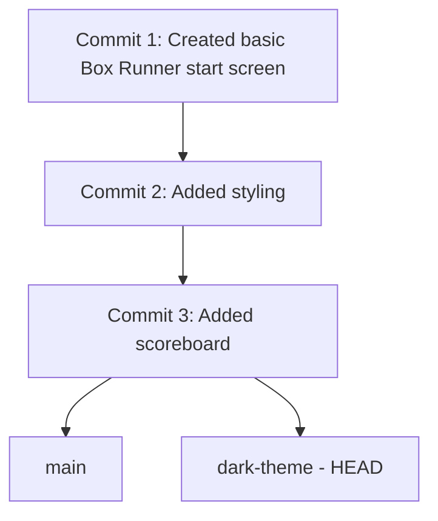

# Architecture — Stage 4: Try a Branch

## Current Structure

```
box-runner/
├── .git/
├── index.html
└── style.css
```

Same as Stage 3. No file added or removed.

## Git History



Both branch labels — `main` and `dark-theme` — point at the same commit. `HEAD` is Git's way of saying "which branch are you on right now?" It points at `dark-theme`.

## What Changed

No files, no commits. The only change is that a second branch label exists in `.git/refs/heads/`. If you opened `.git/refs/heads/dark-theme` in a text editor, you would see the same commit hash that is in `.git/refs/heads/main`.
