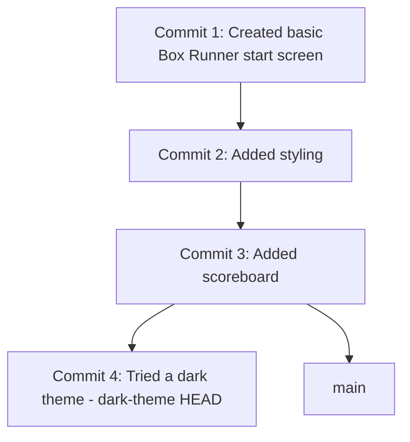

# Architecture — Stage 5: Experiment on the Branch

## Current Structure

```
box-runner/
├── .git/
├── index.html
└── style.css    (dark theme on dark-theme branch, light theme on main)
```

Note that the **file on disk depends on which branch you are on**. Git swaps the file contents when you switch branches.

## Git History



The history now has a fork. `main` stayed at Commit 3. `dark-theme` advanced to Commit 4. They share the first three commits but diverge from there.

## What Changed

This stage demonstrates the core value of a branch. Nothing about your folder structure changed — you still have two files. What changed is that the project now has two visible versions at the same time, selected by which branch you check out.
