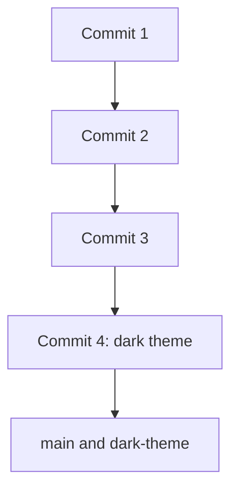

# Architecture — Stage 6: Merge the Branch

## Current Structure

```
box-runner/
├── .git/
├── index.html
└── style.css    (dark theme now — same on both branches)
```

No new files. `style.css` on `main` has been updated to the dark version via the merge.

## Git History



Both branch labels now point at Commit 4. The history is still a straight line because the merge was a fast-forward.

## What Changed

The merge did not create a new commit. It simply moved the `main` label from Commit 3 to Commit 4. This is the simplest kind of merge — no merge commit, no conflicts, no drama.
