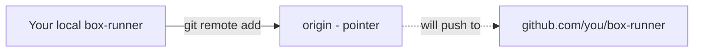

# Architecture — Stage 7: Connect to GitHub

## Current Structure

```
box-runner/          (local)
├── .git/
│   └── config       (now contains a [remote "origin"] section)
├── index.html
└── style.css
```

And on GitHub:

```
github.com/<you>/box-runner   (empty — no commits yet)
```

## Data Flow



The dotted line shows a connection that exists but has not been used yet. `git push` in Stage 8 turns that dotted line solid.

## What Changed

The local repository now knows where its online twin lives. The online repo exists but is empty. The two sides are introduced but not yet synced.
