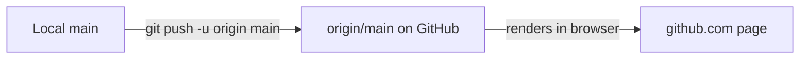

# Architecture — Stage 8: Push to GitHub

## Current Structure

```
box-runner/          (local)
├── .git/
├── index.html
└── style.css
```

```
github.com/<you>/box-runner   (now in sync with local)
├── index.html
├── style.css
└── 4 commits on main
```

## Data Flow



For the first time, the dotted line from Stage 7 is solid. Commits flow from your machine to GitHub.

## What Changed

The repository is no longer just on your laptop. Every save point now exists in two places: your `.git/` folder and GitHub. If your laptop disappeared tomorrow, you could `git clone` the repo back from GitHub and pick up where you left off.
