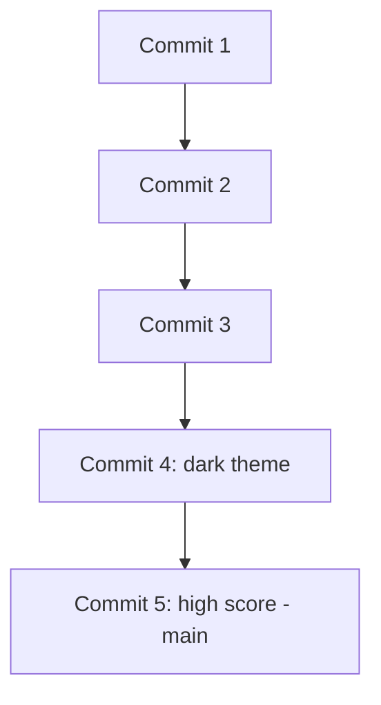

# Architecture — Stage 9: Edit, Commit, Push Again

## Current Structure

```
box-runner/
├── .git/
├── index.html
└── style.css
```

Same two files as Stage 8. One new line inside `index.html`.

## Git History



Five commits now. Every one of them is also on GitHub.

## What Changed

No architectural change. The rhythm is what changed — you completed a full edit/commit/push loop by yourself, with no new concepts introduced. The tutorial ends here because this loop is the whole skill.
